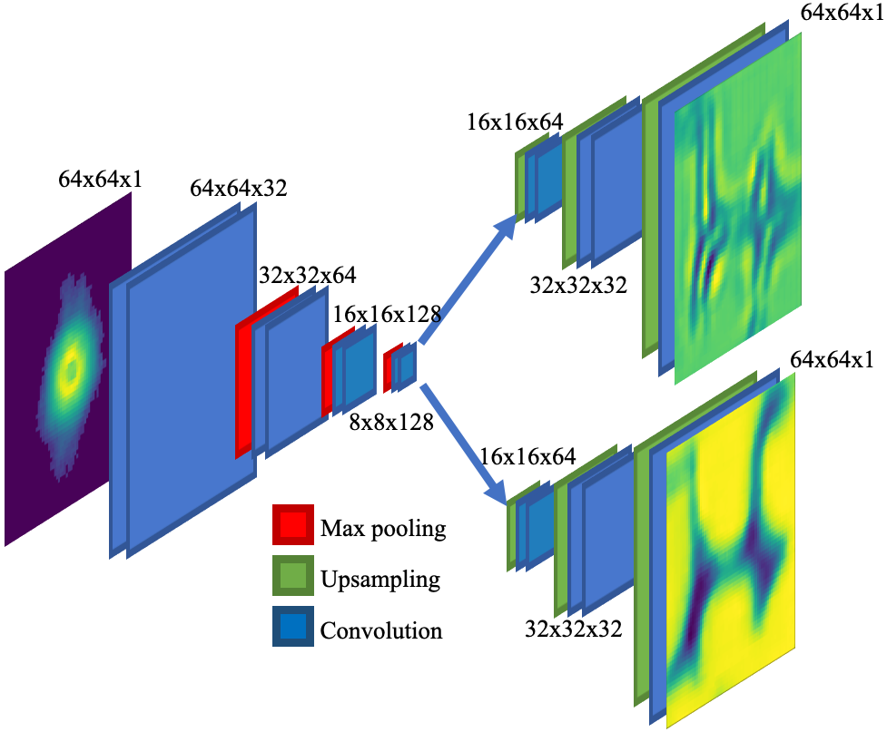

:warning: **WARNING: This branch of the PtychoNN repository contains a python module
implementing workflow tools supporting PtychoNN not the publication
supplemental materials. For the supplemental materials, switch to the default
branch!** :warning:

# PtychoNN: Deep learning of ptychographic imaging

PtychoNN is a two-headed encoder-decoder network that simultaneously predicts
sample amplitude and phase from input diffraction data alone. PtychoNN is 100s
of times faster than iterative phase retrieval and can work with as little as
**25X less data.**

Companion repository to the paper at: https://aip.scitation.org/doi/full/10.1063/5.0013065

The strucuture of the network is shown below:

